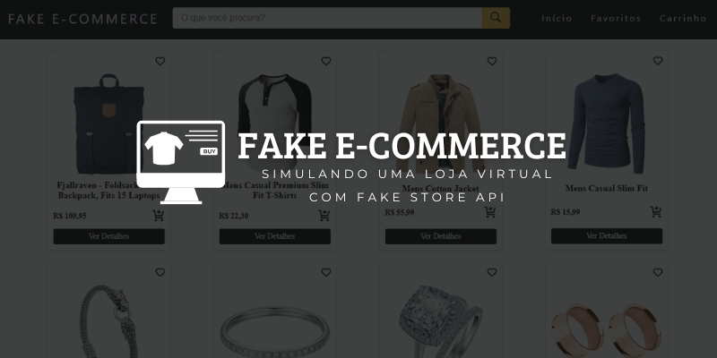

<p align="center">
  
</p>

#  🛒 Fake E-Commerce
Uma aplicação web que simula um e-commerce feita com **JavaScript Vanilla (ES6)**, **HTML** e **CSS**, consumindo a [Fake Store API](https://fakestoreapi.com/) para exibir produtos em tempo real.  
O sistema permite **listar, buscar, favoritar e adicionar produtos ao carrinho**, além de atualizar quantidades e calcular totais dinamicamente.  
Este projeto foi desenvolvido como **atividade avaliativa da disciplina Desenvolvimento de Aplicações Orientadas a Componentes** da **Faculdade Ulbra**, aplicando conceitos de **SPA (Single Page Application)**, **modularização de código** e **armazenamento no `localStorage`** para persistência de dados.  


---
## ✨ Funcionalidades
- Carrega produtos dinamicamente via FakeStoreApi
- Barra de pesquisa dinâmica com filtro por nome e feedback quando não há resultados
- Página inicial exibindo todos os produtos
- Página de detalhes para cada produto  
- Carrinho de compras com:  
  - Adição e remoção de itens  
  - Alteração de quantidades  
  - Cálculo automático do valor total em tempo real  
- Sistema de favoritos (favoritar e desfavoritar produtos)  
- Persistência de dados no `localStorage` para:  
  - Carrinho de compras  
  - Produtos favoritados  


---
## 🕵🏻‍♂️ Visão Geral
- `index.html` – Estrutura base da página, importa os estilos e carrega o main.js, que controla toda a lógica e conteúdo dinâmico da aplicação.

- `services/api.js` – Fornece funções para consumir a Fake Store API, buscando todos os produtos (getProdutos) ou um produto específico por ID (getProdutoById).

- `pages/Home.js` – Página inicial que exibe todos os produtos. Busca os produtos da API (getProdutos) e cria dinamicamente cards para cada um usando o componente Card. Em caso de erro, mostra uma mensagem na tela.

- `pages/Favoritos.js` – Página que exibe os produtos favoritados pelo usuário. Utiliza o localStorage como uma forma de armazenamento de dados persistente no navegador do usuário. Com isso, é possível salvar os itens favoritados pelo usuário guardando-os na página Favoritos, por meio do botão de coração. Também permite remover favoritos diretamente clicando no mesmo botão, atualizando o localStorage e a tela. Se não houver favoritos, exibe uma mensagem centralizada informando que nenhum produto foi adicionado.
    - `assets/css/favoritos.css` - Permite a estilização da página Favoritos, como padding, centralização de títulos e cards, controle de espaçamento entre produtos e formatação da mensagem de "nenhum favorito". 

- `pages/Carrinho.js` – Página que exibe os produtos que o usuário adicionou ao carrinho, com o design inspirado no projeto de finalização do curso [Fundamentos do HTML e CSS](https://github.com/balta-io/3004). Nela é criado uma tabela com os itens, quantidade, preço e total, além de um resumo da compra à direita utilizando aside. Permite aumentar/diminuir quantidade, remover produtos e finalizar a compra. Ao finalizar, exibe um alert de sucesso, limpa o carrinho (localStorage) e mostra uma mensagem informando que não há itens.
    - `assets/css/carrinho.css` – Estiliza a página do carrinho: define layout em duas colunas (produtos e resumo da compra), formata a tabela e botões, controla espaçamento, bordas e cores. Inclui responsividade: adapta tabela e cards para telas pequenas e médias, centralizando conteúdo e tornando elementos mais legíveis em dispositivos móveis.
- `components/Header.js` e `assets/css/header.css` – Componente Header.js cria o cabeçalho da aplicação e o header.css permite sua estilização. Está incluso:
    - **Logo e navegação SPA**: links que não recarregam a página, mudando o conteúdo via CustomEvent e roteamento interno.
    - **Menu Navbar Responsivo**: botão “hamburger” com animação que abre/fecha a navegação em telas pequenas, inspirado na videoaula do canal [Tiger Codes](https://www.youtube.com/watch?v=bHRXRYTppHM&list=LL&index=5).
    - **Barra de busca com filtragem**: input e botão que filtram produtos usando a API de forma dinâmica; exibe resultados dinamicamente ou uma mensagem “Oops!” quando não há correspondência. Baseada na videoaula do canal [Programação Web](https://www.youtube.com/watch?v=VhORHExINuQ&list=LL&index=1).
- `components/Card.js` e `assets/css/card.css`– Componente Card.js que representa cada produto em forma de card, enquanto o card.css cuida de sua estilização. Inclui:
    - **Favoritar**: botão que adiciona ou remove o produto dos favoritos no `localStorage`. O ícone muda de aparência quando o item está favoritado.
    - **Adicionar ao carrinho**: botão que adiciona o produto ao carrinho. Se já estiver no carrinho, incrementa a quantidade e exibe alert.
    - **SPA para detalhes**: botão “Ver Detalhes” que dispara evento de roteamento sem recarregar a página.
- `components/CarrinhoCard.js` – Componente que representa cada item do carrinho em forma de linha (`<tr>`). Resumidamente, esse componente lida com **interatividade de cada item do carrinho** e mantém **consistência entre UI e `localStorage`**, sem tocar diretamente na renderização do carrinho completo Inclui:
    - **Exibição do produto**: mostra imagem, nome, categoria, preço unitário, quantidade e total do item.
    - **Controle de quantidade**: botões `+` e `-` que atualizam a quantidade do item no carrinho, recalculam o total do item e atualizam o `localStorage`.
    - **Remover produto**: botão `x` que remove o item do carrinho chamando a função `removerProduto` passada como parâmetro.
    - **Atualização de subtotal**: cada mudança de quantidade ou remoção dispara `atualizarSubtotal()` para refletir no resumo da compra.
- `components/ProdutoDetalhes.js` e `produtoDetalhes.css` – Componente ProdutoDetalhes.js que exibe a página de detalhes de um produto específico e produtoDetalhes.css responsável por sua estilização. Inclui:
    - **Busca e exibição**: chama `getProdutoById(id)` para buscar os dados do produto e monta um card detalhado com imagem, título, categoria, descrição, preço e avaliação.
    -  **Interatividade**: Botão “Adicionar ao carrinho” atualiza o `localStorage` com o produto, somando quantidade se já existir, e exibe alerta. E o botão “Favoritos” adiciona o produto à lista de favoritos no `localStorage` ou alerta se já estiver adicionado.
- `assets/js/main.js`: Gerenciador principal da SPA, controlando a navegação da mesma, renderizando páginas dinamicamente e mantendo a URL atualizada sem precisar recarregar a página inteira. 
- `assets/global/css`: Responsável pelos estilos globais, reset e classes comuns para títulos, mensagens de erro e layout geral.

---
## 🚀 Como Rodar

1. Clone o repositório:  
   ```bash
   git clone <https://github.com/tamiresdasilva/fake-ecommerce.git>
2. Abra o projeto em uma IDE ou editor de sua preferência.
3. Selecione o `index.html` e o abra usando um servidor de desenvolvimento local (ex: extensão Live Server do VS Code ou qualquer outro de sua preferência).
4. Navegue pela aplicação normalmente: Home, Favoritos, Carrinho e Detalhes dos produtos.


